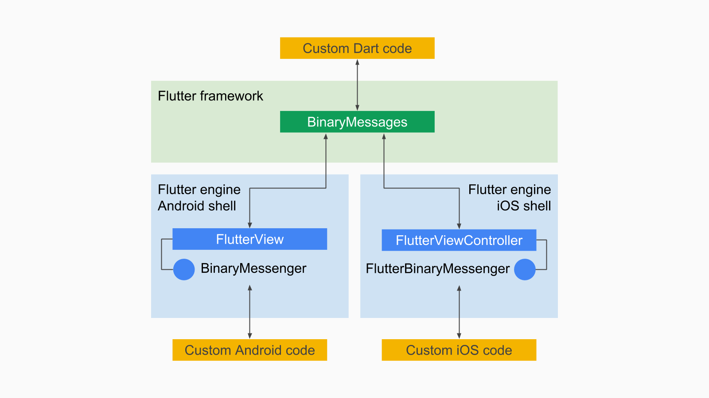

# Native 플랫폼 코드 연동하기 (iOS)

## 참고자료

- [Writing custom platform-specific code - Flutter ](https://flutter.dev/docs/development/platform-integration/platform-channels)
- [Flutter Platform Channels - Flutter - Medium](https://medium.com/flutter/flutter-platform-channels-ce7f540a104e)
- [Building for iOS with Flutter (Google I/O&#39;19) - YouTube](https://www.youtube.com/watch?v=ZBJa-xjZl3w&t=34s)

## 네이티브 코드와 연동이 필요한 이유

- Flutter/Dart로는 UI를 그리는 것은 잘한다.
- File IO나 Network IO도 할 수 있다.
- 그러나 그 외에 디바이스와 밀접한 기능은 Flutter가 다루지 않는다.
  - 푸시 알림, 앱 라이프사이클, 딥링크,...
  - 센서, 카메라, 배터리, 위치, 소리, 연결성,...
  - 다른 앱들과 정보 공유, 다른 앱을 실행시키기,...
  - 디스크에 저장된 설정, 특별한 폴더들, 디바이스 정보,...

플랫폼에 밀접한 기능들은 Flutter가 다룬다고 하더라도 각 OS가 업데이트 되면서 옛날 것이 되기 쉽다.
워낙 종류가 많고, 플랫폼마다 달라서, 이것들을 다 최신 수준으로 지원하기 어렵다.

그래서 Flutter 팀의 선택은...

- 이런 기능들은 Flutter Core에 포함시키지 않고, 필요한 경우, 각각 Native 플랫폼 코드로 작성하게 함.
- 그리고 Flutter/Dart 코드와 플랫폼 코드 사이에 플랫폼 채널이라는 간단하고 일반적인 통신 채널을 제공
- 즉, Flutter가 제공하지 않는 기능이 필요할 때는 Native 코드로 기능을 작성하고 채널을 통해 요청과 결과를 주고 받도록 함.
- 이 채널은 양방향으로 메시지를 주고 받을 수 있음. 따라서 네이티브 코드로 작성한 부분을 Flutter/Dart 코드에서 호출할 수도 있고, 반대로 네이티브 코드에서 이벤트를 받아서 Flutter/Dart에 작성된 API를 호출할 수도 있다.

그리고 이렇게 네이티브 플랫폼 코드로 작성한 기능을 Dart API와 함께 패키지로 감싸서 공유하도록 하였고, 이런 패키지를 플러그인이라고 한다. 즉, 다른 사람이 만들어 배포한 플러그인을 이용하면 직접 네이티브 플랫폼 코드를 작성하지 않고 Dart API로 해당 기능을 사용할 수 있다.

